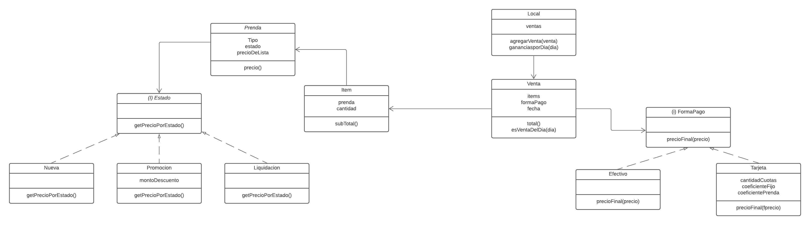

# [Macowins](https://docs.google.com/document/d/1mjWKl9YH9Bb39iIUl1bQj_xhx_-CjCAMpcAXRqKhVjU/edit)


## Resolución

### [Diagrama](https://lucid.app/lucidchart/invitations/accept/inv_4f33fa50-7961-4278-bc6a-234516e54708?viewport_loc=-762%2C-147%2C3216%2C1325%2C0_0)



### PseudoCodigo

```
Interfase Estado{
 metodo: precio getPrecioPorEstado (precioLista)
}
```

```
Clase Nueva implementa Estado{
 metodo: precio getPrecioPorEstado (precioLista)
}
```

```
Clase Promocion implementa Estado{
 montoDescuento
 metodo: precio getPrecioPorEstado (precioLista)
}
```


```
Clase Liquidacion implementa Estado{
 metodo: precio getPrecioPorEstado (precioLista)
}
```

```
Clase Prenda{
 estado
 precioDeLista
 String Tipo
 metodo: precio getPrecio (precioLista)
}
```

```
Clase Item{
 prenda
 cantidad
 metodo: precio subTotal (precioLista)
}
```

```
Clase Venta{
 items
 formaPago
 Dia
 metodo: Bool esVentaDelDia (Fecha)
 metodo: sumatoria total()
}
```
```
Interfase FormaPago
  metodo: precio precioFinal(precioVenta)
}
```

```
Clase Tarjeta Implementa  FormaPago{
  cantidadCuotas
  coeficienteFijo
  coeficientePrenda
  metodo: precio precioFinal(precioVenta)
}
```

```
Clase Efectivo Implementa  FormaPago{
  metodo: precio precioFinal(precioVenta)
}
```

```
Clase Local{
    ventas
    metodo: agregarVenta (venta)
    metodo montoGananca ganancias(dia)
}
```